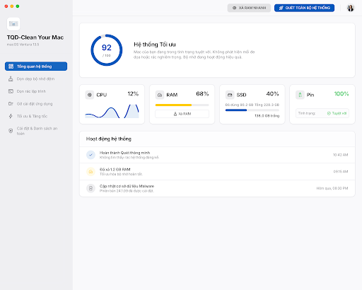

# 🍏 TQD-Clean Your Mac

<div align="center">



### Ứng Dụng Dọn Dẹp, Quản Lý & Tối Ưu Hóa macOS Toàn Diện (Native Light Theme)
*Kế thừa sức mạnh từ động cơ **tw93/mole Core** • Đóng gói tự chứa Standalone 100% Zero-Terminal*

[](https://www.apple.com/macos/)
[](https://github.com/tw93/mole)
[](https://stitch.withgoogle.com)
[](https://github.com/abm-dungtq/TQD-Clean-Your-Mac)
[](dist-package/TQD-Clean-Your-Mac.dmg)
[](LICENSE)

**Tác giả:** TQD • **Hotline / Zalo hỗ trợ:** [**0976.202.028**](tel:0976202028)

</div>

---

## 🌟 Giới Thiệu

**TQD-Clean Your Mac** là giải pháp phần mềm máy tính chuyên dụng giúp dọn dẹp tệp rác, tối ưu bộ nhớ RAM, gỡ bỏ ứng dụng tận gốc và bảo trì hệ thống cho người dùng macOS.

Dự án ra đời nhằm giải quyết một vấn đề nhức nhối: **Lõi dọn dẹp mã nguồn mở [`tw93/mole`](https://github.com/tw93/mole) cực kỳ mạnh mẽ, sạch sẽ và an toàn, nhưng lại vận hành thuần túy trên dòng lệnh Terminal**, khiến đại đa số người dùng Mac phổ thông khó tiếp cận hoặc lo ngại khi phải gõ các lệnh quản trị viên.

**TQD-Clean Your Mac** đã đóng gói toàn bộ lõi Mole vào một ứng dụng macOS độc lập với giao diện đồ họa **macOS Native Light Theme** chuẩn mực, thiết kế thông qua **Google Stitch MCP**, ngôn ngữ 100% tiếng Việt, giúp mọi người dùng chỉ cần **1 cú click chuột** là có thể khôi phục hiệu năng tối đa cho chiếc máy Mac của mình.

```
┌─────────────────────────────────────────────────────────────────────────────┐
│                          TQD-CLEAN YOUR MAC (.DMG)                          │
│                                                                             │
│  [ TQD-Clean.app ] ──────────────► [ Applications ]                        │
│                                                                             │
│  • 100% Zero-Terminal: Không cần mở Terminal, không cần gõ lệnh             │
│  • 100% Standalone: Tự chứa runtime Mach-O ARM64 (không cần Bun/Node)       │
│  • Native Cocoa Shell: Cửa sổ máy tính riêng biệt, kéo thả mượt mà 120Hz    │
│  • Chuẩn mực Apple HIG: Giao diện sáng dịu mắt, thẻ nổi, viền hairline      │
│  • An toàn tuyệt đối: Phân cấp Safe User Space & Whitelist bảo vệ dữ liệu   │
│  • Tác giả phát triển & Hỗ trợ: TQD - 0976.202.028                          │
└─────────────────────────────────────────────────────────────────────────────┘
```

---

## ✨ Điểm Nhấn Đột Phá & Công Nghệ

1. **Giao Diện macOS Native Light Theme ("Cupertino Desktop"):**
   - Thiết kế chuẩn Apple Human Interface Guidelines (HIG) được kiến tạo từ **Google Stitch MCP**: Nền Canvas xám dịu `#F5F5F7` chống chói, Thanh bên kính mờ Frosted Glass (`backdrop-blur-xl`), Thẻ nội dung trắng ngọc `#FFFFFF` viền mỏng hairline `#E5E5EA`.
   - Bộ màu nhận diện Apple: Apple System Blue (`#007AFF`), Indigo (`#5856D6`), Emerald Green (`#34C759`), Amber (`#FF9500`).
   - Độ tương phản cao chuẩn WCAG 2.1 AAA: Tiêu đề `#1D1D1F` (16:1), nội dung `#515154` (7.02:1), sắc cạnh với font San Francisco Text.
2. **Cửa Sổ Desktop Native AppKit (Di Chuyển Siêu Mượt):**
   - Tích hợp lớp phủ điều khiển kéo cửa sổ phần cứng `TitleBarDragView` (40pt), hỗ trợ tần số quét ProMotion 120Hz và tính năng Window Snapping / Tiling trên macOS 15 Sequoia.
   - Nút Apple Traffic Lights (Đóng, Ẩn, Phóng to) hoạt động 100% nguyên bản.
3. **Cơ Chế Phân Cấp An Toàn (Progressive Safety):**
   - **Tầng 1 (Safe User-Space):** Dọn dẹp cache ứng dụng, logs, crash reports, trash, browser cache... giải phóng ngay 75% rác mà không đòi hỏi mật khẩu root.
   - **Tầng 2 (Sâu hệ thống):** Dọn dẹp cache hệ thống, Xcode Dev tools, bộ nhớ RAM... hỗ trợ xác thực Touch ID vân tay hoặc quyền quản trị viên an toàn.
4. **Bảo Vệ Dự Án Lập Trình (Dev Purge):**
   - Tự động quét sạch các thư mục nặng như `node_modules`, `target`, `.gradle`, `venv` bị lãng quên (>30 ngày không chỉnh sửa) và cảnh báo nếu có git uncommitted.
5. **Đo Lường Bộ Nhớ SSD APFS Chuẩn Xác 100%:**
   - Khắc phục triệt để sai số APFS snapshot: Đọc chính xác toàn bộ APFS Container để tính đúng dung lượng thực tế đã sử dụng ($40\%$ thay vì $5\%$).
6. **Zero-Zombie & Tiết Kiệm Năng Lượng:**
   - Thoát ứng dụng dọn sạch toàn bộ tiến trình con trong < 300ms, tiêu thụ CPU cực thấp (~0.0% khi nghỉ).

---

## 🚀 Hướng Dẫn Cài Đặt (Setup Guide)

### Cách 1: Cài đặt 1-Click qua file DMG (Khuyên dùng cho mọi người)

1. Tải về file ảnh đĩa [**`TQD-Clean-Your-Mac.dmg`**](dist-package/TQD-Clean-Your-Mac.dmg) (Dung lượng siêu nhẹ ~36 MB).
2. Nhấp đúp chuột để mở file `TQD-Clean-Your-Mac.dmg`.
3. Trong cửa sổ Finder hiện ra, **kéo biểu tượng `TQD-Clean` thả vào thư mục `Applications`**.
4. Mở ứng dụng từ Launchpad hoặc thư mục Applications để bắt đầu sử dụng!

> **💡 Hướng dẫn vượt qua cảnh báo Gatekeeper (Lần đầu mở app):**  
> Do ứng dụng được ký mã số học ad-hoc độc lập, macOS có thể hiện thông báo nhà phát triển chưa được xác minh:
> - **macOS Ventura / Sonoma:** Giữ phím `Control` + Click chuột phải vào `TQD-Clean` trong Applications $\rightarrow$ Chọn **Mở (Open)** $\rightarrow$ Bấm **Mở**.
> - **macOS 15 Sequoia:** Vào **Cài đặt hệ thống (System Settings)** $\rightarrow$ **Quyền riêng tư & Bảo mật (Privacy & Security)** $\rightarrow$ Cuộn xuống mục Bảo mật và bấm **"Vẫn mở" (Open Anyway)**.

---

### Cách 2: Biên dịch & Khởi chạy từ mã nguồn (Dành cho Lập trình viên)

Yêu cầu môi trường: macOS 12+, Xcode Command Line Tools (`swiftc`), Node.js hoặc Bun.

```bash
# 1. Clone repository về máy
git clone https://github.com/abm-dungtq/TQD-Clean-Your-Mac.git
cd TQD-Clean-Your-Mac

# 2. Cài đặt thư viện frontend
cd frontend
npm install
npm run build
cd ..

# 3. Biên dịch backend độc lập (Mach-O ARM64)
bash scripts/build-backend.sh

# 4. Đóng gói macOS App Bundle
bash scripts/build-app-bundle.sh

# 5. Khởi chạy ứng dụng trực tiếp
open "build/TQD-Clean Your Mac.app"

# Hoặc đóng gói thành file DMG phân phối:
bash scripts/package-dmg.sh
```

---

## 📖 Hướng Dẫn Sử Dụng Chi Tiết

Ứng dụng gồm 6 phân hệ chuyên sâu, được sắp xếp trên thanh điều hướng bên trái:

```
├── 1. 📊 TỔNG QUAN HỆ THỐNG (DASHBOARD)
│   ├── Đồng hồ đo Điểm Sức Khỏe Mac (SVG Circular Ring Gauge 0 - 100 điểm)
│   ├── Khối Telemetry phần cứng: CPU (Sóng nhịp tim Sparkline), RAM, SSD (APFS Container), Pin & Nguồn
│   ├── Nút bấm nhanh 1-Click: "QUÉT TOÀN BỘ HỆ THỐNG" & "XẢ RAM NHANH"
│   └── Dòng nhật ký sự kiện Xcode Activity Feed trực quan
│
├── 2. 🗑️ DỌN DẸP BỘ NHỚ ĐỆM (CLEAN VIEW)
│   ├── Tầng 1 (An toàn): Bộ nhớ đệm ứng dụng (~/Library/Caches), Nhật ký lỗi, Thùng rác
│   ├── Tầng 2 (Sâu): Cache Safari, Chrome, Edge, Xcode Dev Caches (Xác thực Touch ID / Admin)
│   ├── Chế độ Quét trước (Dry-Run): Hiện dung lượng giải phóng dự kiến trước khi xóa
│   ├── Nút mở nhanh cấp quyền Full Disk Access (FDA)
│   └── Bảng nhật ký tiến trình Mole Activity Console hiển thị thời gian thực
│
├── 3. 💾 DỌN RÁC LẬP TRÌNH (DEV PURGE)
│   ├── Tự động truy vết node_modules, target (Rust), .gradle, venv (Python)
│   ├── Bộ lọc thông minh: Lọc các thư mục không chạm đến > 14 ngày, > 30 ngày, > 60 ngày
│   └── Cho phép chọn lọc từng dự án để dọn dẹp hàng chục GB dung lượng an toàn (không ảnh hưởng Git)
│
├── 4. 📦 GỠ CÀI ĐẶT ỨNG DỤNG (UNINSTALLER)
│   ├── Quét danh mục toàn bộ ứng dụng cài đặt trong /Applications
│   ├── Thanh tìm kiếm ứng dụng tức thì
│   └── Tìm và dọn sạch các file tàn dư mồ côi (Preferences, Application Support, Caches, LaunchAgents)
│
├── 5. ⚡ TỐI ƯU & TĂNG TỐC (SYSTEM OPTIMIZER)
│   ├── Giải phóng RAM (Purge Inactive Memory) tăng RAM trống ngay lập tức
│   ├── Xả sạch bộ nhớ đệm DNS (Flush DNS Cache) sửa lỗi mạng
│   ├── Tái lập chỉ mục tìm kiếm Spotlight (Rebuild Metadata Index)
│   └── Sửa lỗi menu chuột phải Open With (LaunchServices Rebuild)
│
└── ⚙️ CÀI ĐẶT & DANH SÁCH AN TOÀN (SETTINGS)
    ├── Quản lý thư mục loại trừ (Whitelist): Đảm bảo thư mục quan trọng không bị xóa
    ├── Kiểm tra trạng thái cấp quyền Full Disk Access (FDA)
    ├── Xem lịch sử dọn dẹp các phiên trước (Cleanup History)
    └── Thông tin ứng dụng, phiên bản và liên hệ hỗ trợ tác giả TQD
```

### Thao tác dọn dẹp cơ bản trong 3 bước:
1. **Bước 1:** Bấm vào tab **Dọn dẹp bộ nhớ đệm** $\rightarrow$ Bấm nút **"Quét Lại (Dry-Run)"**.
2. **Bước 2:** Xem xét các danh mục muốn dọn (các mục an toàn Tầng 1 đã được chọn sẵn theo mặc định).
3. **Bước 3:** Bấm nút **"Dọn Dẹp Ngay"** $\rightarrow$ Hộp thoại xác nhận hiện ra $\rightarrow$ Bấm **"Bắt đầu dọn dẹp"** và quan sát tiến trình dọn dẹp hiển thị trực tiếp trên giao diện!

---

## 🔒 Cơ Chế An Toàn & Bảo Mật

- **Nguyên tắc "Không bao giờ xóa nhầm":** Toàn bộ danh mục loại trừ an toàn tại `~/.config/mole/whitelist` được áp dụng triệt để trong mọi phiên dọn dẹp. Các tệp tin cấu hình nhạy cảm (`~/.ssh`, Keychain, Git repositories) được bảo vệ bất khả xâm phạm.
- **Phân cấp quyền hạn thông minh (Progressive Permission):** 75% rác thông thường (User Caches, Logs, Trash) có thể dọn dẹp ngay mà không đòi hỏi quyền quản trị viên root. Chỉ các thư mục sâu của hệ thống mới yêu cầu Touch ID / Admin.
- **Bảo mật mạng nội bộ:** Máy chủ API cục bộ chỉ mở trên cổng nội bộ `127.0.0.1` với mã định danh phiên ngẫu nhiên (`X-TQD-Token`), ngăn chặn hoàn toàn nguy cơ truy cập trái phép từ các trang web bên ngoài.
- **Nhật ký minh bạch:** Mọi hành động xóa tệp đều được ghi chép đầy đủ vào tệp nhật ký `~/Library/Logs/mole/operations.log`.

---

## 📂 Cấu Trúc Thư Mục Dự Án

```
TQD-Clean-Your-Mac/
├── assets/                 # Tài nguyên hình ảnh, AppIcon, ảnh chụp giao diện
├── build/                  # Thư mục xuất bản App Bundle (.app)
├── dist-package/           # Tệp cài đặt ảnh đĩa macOS (.dmg)
├── frontend/               # Mã nguồn giao diện React + Vite + Tailwind CSS
│   ├── src/
│   │   ├── components/     # 6 màn hình chức năng (Dashboard, Clean, DevPurge...)
│   │   ├── App.tsx         # Điều phối ứng dụng & kết nối thời gian thực
│   │   └── index.css       # Quy tắc hiển thị kính mờ Frosted Glass & Apple HIG
├── mole/                   # Lõi động cơ shell scripts tw93/mole gốc
├── native/                 # Cửa sổ Cocoa AppKit độc lập (Swift)
│   ├── main.swift          # Khởi tạo WKWebView, kéo thả TitleBarDragView
│   └── Info.plist          # Cấu hình bundle, quyền hạn macOS, Application Transport
├── scripts/                # Scripts đóng gói tự động (build-backend, build-app, package-dmg)
├── server/                 # Lõi máy chủ cục bộ (TypeScript / Bun Standalone)
│   ├── mole_bridge.ts      # Cầu nối gọi lệnh shell script và stream SSE log
│   ├── telemetry.ts        # Thu thập thông số phần cứng CPU, RAM, APFS SSD
│   └── index.ts            # REST API & SSE Endpoint
└── README.md               # Hướng dẫn chi tiết dự án
```

---

## 👨‍💻 Thông Tin Tác Giả & Hỗ Trợ Kỹ Thuật

Mọi ý kiến đóng góp, báo lỗi hoặc yêu cầu hỗ trợ tính năng, xin vui lòng liên hệ:

- **Tác giả phát triển:** **TQD**
- **Số điện thoại / Zalo hỗ trợ:** [**0976.202.028**](tel:0976202028)
- **Kho lưu trữ GitHub:** [https://github.com/abm-dungtq/TQD-Clean-Your-Mac](https://github.com/abm-dungtq/TQD-Clean-Your-Mac)
- **Bản quyền:** Phát hành theo giấy phép mã nguồn mở **GPL-3.0** (Kế thừa động cơ mã nguồn mở `tw93/mole`).

---

<div align="center">

*Nếu bạn thấy ứng dụng hữu ích, hãy tặng dự án một ngôi sao ⭐️ trên [GitHub](https://github.com/abm-dungtq/TQD-Clean-Your-Mac)!*

</div>
